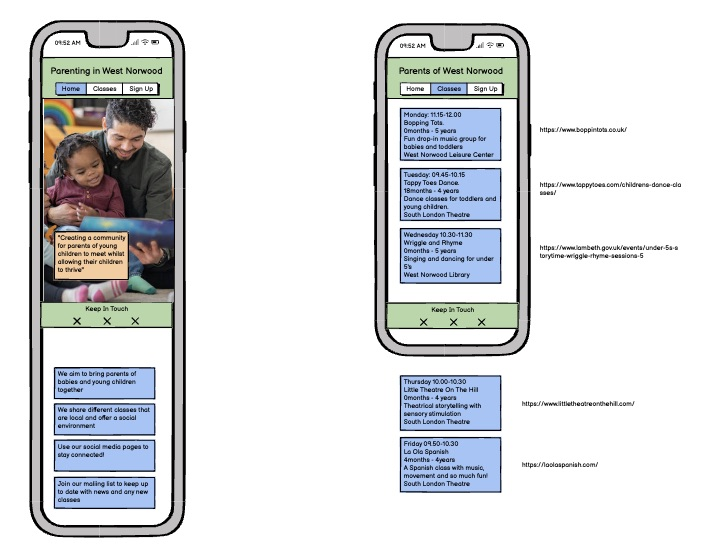

# West Norwood Parenting

Welcome user,

West Norwood Parenting has been designed to bring parents together from the West Norwood area. With the demands of parenting, it can often be lonely and difficult to meet other parents, especislly for first-time parents. This site offers a range of classes, where you can take your children whilst meeting other parents at the same time. There is also a form where you can sign up to hear about social events for parents and upcoming classes.

The site can be accessed by this [link](https://l-copeman.github.io/west-norwood-parenting/)

---

## User stories

### First Time Visitor Goals

* As a first time visitor, I want to easily understand the main purpose of the site. 
* As a first time visitor, I want to be able to easily navigate through the website, so I can find the content.

### Returning Visitor Goals

* As a returning visitor, I want to see the various classes that are shown.
* As a returning visitor, I want to see all the relevant information for the class and follow the link to book a class.
* As a returning visitor, I want to stay connected using the social media pages.
* As a returning visitor, I want to be able to sign-up to keep updated for social events and new classes.

### Frequent Visitor Goals

* As a frequent visitor, I want to view new classes that have been added.

---

## Features

- ### Nav bar

* Positioned at the top of the page.
* The position is fixed, so the nav bar is always visible allowing for easier navigation through the site.
* The name for the group is on the left-hand side of the nav bar.
    * The name is responsive, enlarging for bigger screen sizes.
* Navigation links are positioned on the right of the nav bar:
    * HOME - takes the user to the home page.
    * CLASSES - takes the user to the classes page, where different classes can be viewed.
    * SIGN-UP - takes the user to the sign-up page, where they can fill a form to receive information about social events. and upcoming classes.
* The links are animated with hover effect.    

---

- ### Footer

* The footer is positioned at the bottom of the page.
* It contains links for each of our social media pages
    * Facebook
    * X
    * Instagram
* Each link is represented by an icon for the relevant social media page.
* They are all positioned in the center of the footer.
* Each link will open in a new page    

- ### Main Page

* The page is dominated by an image of a young family, in a relaxed happy environment.
* The groups tagline is displayed which serves to clarify the thought of the page.

* Towards the bottom of the page are four areas of text. These give the user key information of the groups goals.
    * This text is repsonsive. The text-size increases for larger screens and their containers change size accordingly.

---

- ### Classes Page

* At the top of the page is a heading, informing the user that a selection of classes can be viewed.
* There is a circular image, showing children playing in a friendly environemnt.
    * This image is responsive. The height increases for larger screens.

* There are links to each specific day of the week, for the relevant classes. The links are animated with hover effect.
* Each day of the week has its own heading.
* Each class contains:
    * The name of the class.
    * The age group for the class.
    * A short description of the class.
    * The venue for the class.
    * A link to the class website, where you can book. (link opens in new tab)

    

--- 

- ### Sign-up Page

* At the top of the page is a heading, informing the user that they can sign-up to hear about social events and upcoming classes.
* There is a circular image, showing hands in a group, representing togetherness.
    * This image is responsive. The height increases for larger screens.
* There is a button with a link to the form below, ensuring users are aware of the form and where to find it.

* Users can fill in the form to keep updated of social events and classes.
* The form ask users for:
    * First Name
    * Second Name
    * Email Address
    * Age of their children. 
* All fields are mandatory 
* The Submit button can be clicked when all information has been entered.

---

- ### Responses Page

* In the center of the page is a thank you message, for signing up to our community.
* A 'Back to Home Page' button has been added to easily direct users back to the home page.

---

### Technologies Used

- [HTML](https://developer.mozilla.org/en-US/docs/Web/HTML) - was used as the foundation of the site.
- [CSS](https://developer.mozilla.org/en-US/docs/Web/css) - was used to add the styles and layout of the site.
- [CSS Flexbox](https://developer.mozilla.org/en-US/docs/Learn/CSS/CSS_layout/Flexbox) - was used to arrange items on the pages.
- [Balsamiq](https://balsamiq.com/) - was used to make wireframes for the website.
- [Gitpod](https://www.gitpod.io/) - was used as the main tool to write and edit code.
- [GitHub](https://github.com/) - was used to host the code of the website.

---

## Design

### Colour

* Light pink colour was used for header and footer sections, as well as form background. I chose it because it evokes memories of childhood, whilst also being a warm and comforting colour.
* A dark blue colour was used for classes and responses pages background, as well as other details. I chose it because it contrasts well with the pink used and is associated with knowledge, authority, and reliability.
* A darker shade of pink was used on the classes page and sign-up page. This darker shade is a calming colour associated with love and kindness.

### Typography

* Mulish was used as the main font of the website in order to increase readability of the content on the pages.

### Wireframe

* I used Balsamiq to create wireframes of my ideas

---

## Testing

### Validator Testing

- #### HTML

#### Home Page

No errors or warnings were found when passing through the official W3C validator.

### Classes Page

No errors or warnings were found when passing through the official W3C validator.

### Sign-up Page

No errors or warnings were found when passing through the official W3C validator.

#### Responses Page

No errors or warnings were found when passing through the official W3C validator.

- #### CSS

No errors or warnings were found when passing through the official W3C (Jigsaw) validator.

---

### Lighthouse Report

* #### Home Page

* #### Classes Page

* #### Sign-up Page

* #### Responses Page

---

### Manual Testing

Maunal tests carried out by multiple users:

* Home link
* Classes link
* Sign-up link
* Facebook link
* X link
* Instagram link
* Monday link
* Tuesday link
* Wednesday link
* Thursday link
* Friday link
* Boppin' Tots webpage link
* Tappy Toes Dance link
* Wriggle and Rhyme link
* Little Theatre on The Hill link
* La Ola Spanish link
* First name required
* Second name required
* Email required
* Age of children required
* Submit link 
* Back to Home Page link   

## Deployment

### Deployment to GitHub Pages

- The site was deployed to GitHub pages. The steps to deploy are as follows: 
  - In the [GitHub repository](https://github.com/l-copeman/west-norwood-parenting), navigate to the Settings tab 
  - From the source section drop-down menu, select the **Main** Branch, then click "Save".
  - The page will be automatically refreshed with a detailed ribbon display to indicate the successful deployment.

The live link can be found [here](https://l-copeman.github.io/west-norwood-parenting/)

---

## Future Improvements

---

## Credits

#### Images

All images were taken from:
* [Pexels](https://www.pexels.com/)
* [Unsplash](https://unsplash.com/)

---

## Acknowledgements

